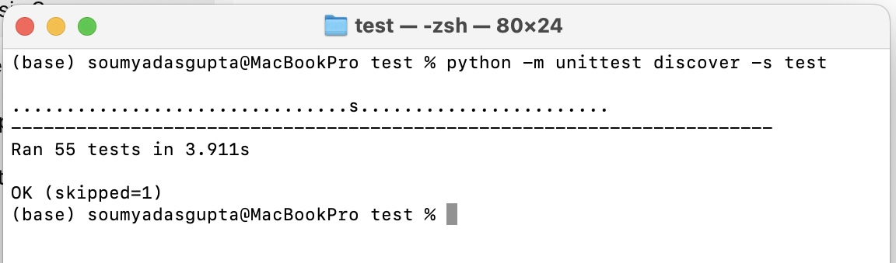
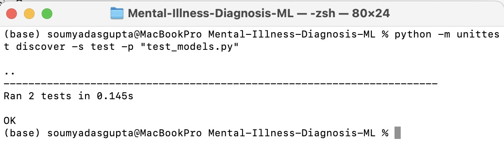

# Predicting-Mental-Health


# Mental Illness Diagnosis Using Machine Learning

## **Overview**
Mental illness is one of the leading causes of disability worldwide. Diagnosing mental illness early can drastically improve the quality of life of individuals. This project focuses on building machine learning models to predict whether an individual is likely to suffer from mental illness based on various demographic and behavioral features. Using data science techniques such as classification and model evaluation, this project aims to create a robust model for mental illness diagnosis.

## **Project Objectives**
1. **Data Analysis**: Extract useful insights from the depression dataset using exploratory data analysis (EDA) techniques.
2. **Modeling**: Build several machine learning models, including Random Forest, XGBoost, and Logistic Regression, to predict the likelihood of mental illness.
3. **Evaluation**: Assess model performance using metrics like ROC-AUC, classification report, and feature importance analysis.

The project uses the Kaggle [Depression Dataset](https://www.kaggle.com/datasets/anthonytherrien/depression-dataset) for training and evaluating the models.

## **Key Features**
- **Exploratory Data Analysis (EDA)**: Detailed analysis of the dataset using visualizations and statistical methods.
- **Data Preprocessing**: Handling missing data, encoding categorical variables, and feature engineering.
- **Machine Learning Models**: Implementation of classification models such as Logistic Regression, Random Forest, XGBoost, and LightGBM.
- **Model Evaluation**: Metrics including ROC-AUC, confusion matrix, and feature importance to assess model performance.
- **Unit Testing**: Ensures the quality and robustness of the code.

## **Features in the Dataset**
The dataset contains several features, including:
- **Age**: Age of the individual.
- **Marital Status**: Relationship status (e.g., Married, Single).
- **Education Level**: Highest education achieved.
- **Number of Children**: The number of children the individual has.
- **Smoking Status**: Smoking habits (e.g., Non-smoker, Smoker).
- **Physical Activity Level**: Physical activity level (e.g., Active, Sedentary).
- **Income**: Annual income.
- **Alcohol Consumption**: Frequency of alcohol consumption.
- **Dietary Habits**: Type of diet followed (e.g., Healthy, Unhealthy).
- **Sleep Patterns**: Quality of sleep (e.g., Good, Poor).
- **History of Mental Illness**: Whether the individual has a history of mental illness (target variable).

## **Table of Contents**
1. [Installation Instructions](#installation-instructions)
2. [Usage Instructions](#usage-instructions)
3. [Project Structure](#project-structure)
4. [Contributing](#contributing)
5. [References](#references)

## **Installation Instructions**
To run this project locally, follow these steps:

### 1. Clone the Repository:
   ```bash
   git clone https://github.com/your_username/Mental-Illness-Diagnosis-ML.git
   cd Mental-Illness-Diagnosis-ML
   ```

### 2. Set up a Virtual Environment:
   Create a virtual environment to isolate the dependencies.
   ```bash
   python3 -m venv env
   source env/bin/activate  # On Windows, use 'env\Scripts\activate'
   ```

### 3. Install Required Libraries:
   Install the necessary libraries using `pip`.
   ```bash
   pip install -r requirements.txt
   ```

### 4. Download the Dataset:
   Download the **Depression Dataset** from [Kaggle](https://www.kaggle.com/datasets/anthonytherrien/depression-dataset/data) and place it in the project folder.

## **Usage Instructions**

### Running the Model:
To train the models and evaluate them, use the following command:
```bash
python src/models.py
```

### Running Unit Tests:
To ensure the correctness of the code, run the unit tests:
```bash
python -m unittest discover -s test
```

This will run all the tests in the `test/` directory.

### Model Evaluation:
Model performance is evaluated using metrics like ROC-AUC, classification reports, and feature importance. You can visualize feature importance by running:
```bash
python src/model_evaluation.py
```

## **Project Structure**
The project is organized as follows:
```
Mental-Illness-Diagnosis-ML/
├── README.md              # Project overview and instructions
├── requirements.txt       # Python libraries required
├── src/                   # Source code for the project
│   ├── data_preprocessing.py  # Data loading and cleaning
│   ├── feature_engineering.py  # Feature engineering
│   ├── models.py              # Model training and evaluation
│   ├── model_evaluation.py    # Model evaluation and performance metrics
│   └── utils.py               # Utility functions
├── test/                   # Unit tests for various components
│   ├── test_data_preprocessing.py  # Tests for data preprocessing
│   ├── test_feature_engineering.py  # Tests for feature engineering
│   ├── test_models.py           # Tests for model training
│   └── test_model_evaluation.py   # Tests for model evaluation
└── code_submission.pdf      # A copy of the code for submission
```

### Files in `src/`:
- **`data_preprocessing.py`**: Handles data cleaning, missing value handling, and categorical variable encoding.
- **`feature_engineering.py`**: Contains code for generating new features and transforming existing ones.
- **`models.py`**: Implements machine learning models and handles training and evaluation.
- **`model_evaluation.py`**: Includes functions to evaluate model performance (e.g., ROC-AUC, classification report).
- **`utils.py`**: Utility functions used across the codebase.

### Files in `test/`:
- **`test_data_preprocessing.py`**: Contains unit tests for data preprocessing functions.
- **`test_feature_engineering.py`**: Contains unit tests for feature engineering functions.
- **`test_models.py`**: Contains unit tests for model training functions.
- **`test_model_evaluation.py`**: Contains unit tests for model evaluation functions.

________
### Unit Tests : 
  
  
________

## **Contributing**
If you’d like to contribute to this project, feel free to fork the repository, create a branch for your changes, and submit a pull request. Ensure that all tests pass before submitting your changes.

### Steps for contributing:
1. Fork the repository.
2. Clone your fork:
   ```bash
   git clone https://github.com/your_username/Mental-Illness-Diagnosis-ML.git
   ```
3. Create a new branch:
   ```bash
   git checkout -b feature-name
   ```
4. Make your changes and commit:
   ```bash
   git commit -m "Add feature X"
   ```
5. Push your changes:
   ```bash
   git push origin feature-name
   ```
6. Create a pull request on GitHub.

## **References**
- **Kaggle Depression Dataset**: [https://www.kaggle.com/datasets/anthonytherrien/depression-dataset/data](https://www.kaggle.com/datasets/anthonytherrien/depression-dataset/data)
- **Scikit-learn Documentation**: [https://scikit-learn.org/](https://scikit-learn.org/)
- **XGBoost Documentation**: [https://xgboost.readthedocs.io/](https://xgboost.readthedocs.io/)
- **LightGBM Documentation**: [https://lightgbm.readthedocs.io/](https://lightgbm.readthedocs.io/)

---

## **Contact**
For questions or feedback, reach out to:
- **Name**: Soumya Dasgupta
- **Email**: soumya_02@outlook.com  
- **GitHub**: www.github.com/soumyadg


